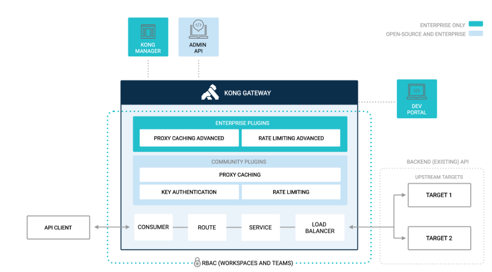

# api gateway kong

### 아키텍처

| CONCEPT/FEATURE                 | DESCRIPTION                                                                      |
|:--------------------------------|:---------------------------------------------------------------------------------|
| Service                         | 업스트림 API 및 마이크로서비스를 참조하는데 사용하는 ID                                                |
| Routes                          | 라우팅 방식 지정. 단일 서비스에 여러 경로를 지정할 수 있다.                                              |
| Consumers                       | API 최종 사용자. API 에 대한 엑세스를 제어 할수 있고, 로깅 플러그인과 Kong Vitals 를 사용하여 트래픽을 리포트 할 수 있다. |
| KongManager                     | kong gateway 를 모니터링하고 관리하기 위한 브라우저 기반 시각화 도구                                     |
| AdminAPI                        | 관리 목적의 내부 restful api. api 명령은 클러스터의 모든 노드에서 실행 할 수 있으며, 구성은 모든 노드에 일관되게 적용된다.   |
| Plugins                         | kong gateway 기능을 수정하고 제어하기 위한 모듈들을 제공한다.                                         |
| Rate Limiting plugin            | http 요청수 제한                                                                      |
| *Rate Limiting Advanced plugin* | sliding window 및 헤더 및 서비스별로 제한하는 기농 제공                                           |
| Proxy Caching plugin            | proxy caching                                                                    |
| *Proxy Caching Advanced plugin* | Redis 및 Redis Sentinel 배포를 지원                                                    |
| Key Auth plugin                 | service 또는 route 에 인증 추가                                                         |
| Key Auth - Encrypted plugin     | API 키를 Kong Gateway 데이터 저장소 내에 암호화된 형식으로 저장                                      |
| Load Balancing                  | DNS-based 또는 ring-balancer 두 가지 형태 제공. ring-balancer 는 변경시 DNS 업데이트가 필요하지 않음     |
| **User Authorization (RBAC)**   | RBAC(역할 기반 액세스 제어)를 통해 사용자 권한 부여                                                 |
| *Dev Portal*                    | 개발자 포탈                                                                           |

### 주요 기능

- Nginx + Cassandra + Lua script 기반
- 밀리 초 미만의 처리 대기 시간 지원 및 높은 처리량, 고성능
- Lua 또는 GoLang 에서 확장성이 좋다.
- 플러그인을 통해 로드밸런싱, 로깅, 인증, 속도제한, 변환등을 제공
- 모든 플랫폼, 모든 클라우드에서 실행이 가능하고 kubernetes 를 기본적으로 지원한다.
- 모든 기능을 rest interface 로 제공한다.

### 필요한 기능들

- 설정
  - postgres, cassandra 또는 db 없이 config file 사용
    - db-less mode 는 Kong 1.1 이후 버전에서 사용 가능
      - 장점
        - kong 설정 전체를 단일 YAML(또는 JSON) 파일에 저장하여 관리가 편하다.
        - 설정 파일을 사용함으로서 배포 파이프라인을 자동화 할 수 있다.
        - DB 를 사용하지 않아서 리소스를 절약할 수 있다.
      - 단점
        - 일부 DB 에 의존적인 플러그인을 사용할 수 없다.
          - rest api 를 이용해 kong cluster 를 관리할 수 있는 Admin API 를 사용할 수 없다.(읽기용도로만 사용 가능)
          - 설정을 변경하기 위해서는 설정파일을 수정한 후 재배포해야 한다.
          - acl, basic-auth, hmac-auth, jwt, key-auth 등은 일부 기능이 사용 불가능 하게 되며, DB 기반으로 동작하는 rate-limiting,
            response-ratelimiting 플러그인은 사용할 수 없게 된다.

- 라우팅
  - 다음과 같은 형태로 사용한다.
    - ~~~yml
      services:
        - name: sample1-public
          url: '<http://sample1.com>'
          routes:
            - name: sample1-public-route
              strip_path: false
              paths:
                - /public/sample1
        - name: sample2-public
          url: '<http://sample2.com>'
          routes:
            - name: sample2-public-route
              strip_path: false
              paths:
                - /public/sample2
      ~~~
  - 헤더 별로 라우팅 하는건 플러스 버전에서 가능
- 로드 밸런서
  - DNS, ring-balancer 기반 밸런싱을 지원한다.
  - ring-balancer
    - 지원 알고리즘: 
      - round-robin
      - consistent-hashing: consumerID, ip, header, cookie 로
      - least-connections: target weight 속성에 따라 가중치가 적용된 연결 수가 가장 적은 대상을 선택하는 알고리즘 지원
    - 주의 사항
      - kong 클러스터에 해싱 접근 방식을 사용할때 target 항목을 이름으로 추가하지 말고 ip 주소로만 추가해야 한다.
      - 해시 입력을 선택할 때는 충분히 분산이 되었는지 확인 필요
- 인증
- 로깅

### 참고

- [kong docs](https://docs.konghq.com/gateway/2.7.x/get-started/comprehensive/)