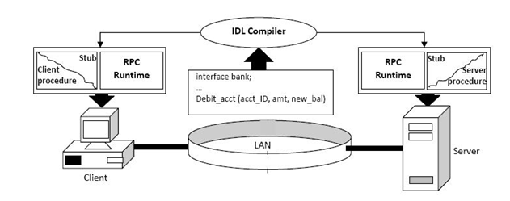

# IPC(Inter-Process Communication) 관련 비교 분석하기 

- 프로세스간 통신하는 방법론을 통칭하여 IPC(Inter Process Communication) 라고 한다.
- 내부 서버끼리 통신에 rest api 가 아닌 다른 것을 도입하기 위해 이것저것 조사해서 정리해본다.

### gRPC(Google Remote Procedure Call)

- rpc 란?
  - 이름 그대로 네트워크로 연결된 서버 상의 프로시저(함수, 메서드 등) 를 원격으로 호출할 수 있는 기능이다.
  - 네트워크 통신을 위한 작업 하나하나 챙기기 귀찮으니 통신이나 call 방식에 신경쓰지 않고 원격지의 자원을 내 것처럼 사용하는 것이다.
  - IDL(Interface Definication Language) 기반으로 다양한 언어를 가진 환경에서도 쉽게 확장이 가능하다.
    - 지원 언어: C++, Java, Python, Ruby, Node.js, C#, Go, PHP, Objective-C …
  - PRC 의 핵심 개념 Stub(스텁)
    - 서버와 클라이언트는 서로 다른 주소 공간을 사용 하므로, 함수 호출에 사용된 매개 변수를 꼭 변환해줘야 하는데 이걸 담당하는게 스텁이다.
    - client stub 은 함수 호출에 사용된 파라미터의 변환(Marshalling, 마샬링) 및 함수 실행 후 서버에서 전달 된 결과의 변환을 담당한다.
    - server stub 은 클라이언트가 매개 변수의 역변환(Unmarshalling, 언마샬링) 및 함수 실행 결과 변환을 담당하게 된다.
  - 
    - `1)` IDL 을 사용하여 호출 규악을 정의한다.
      - 함수명, 인자, 반환값에 대한 데이터형이 정의된 IDL 파일을 rpcgen 으로 컴파일하면 stub code 가 자동으로 생성된다.
    - `2)` Stub Code 에 명시된 함수는 원시코드의 형태로, 상세 기능은 server 에서 구현된다.
      - 만들어진 stub 코드는 클라이언트/서버에 함께 빌드한다.

### RSocket
### HTTP3(QUIC)

### 참고

- [시대의 흐름, gRPC 깊게 파고들기](https://medium.com/naver-cloud-platform/nbp-%EA%B8%B0%EC%88%A0-%EA%B2%BD%ED%97%98-%EC%8B%9C%EB%8C%80%EC%9D%98-%ED%9D%90%EB%A6%84-grpc-%EA%B9%8A%EA%B2%8C-%ED%8C%8C%EA%B3%A0%EB%93%A4%EA%B8%B0-1-39e97cb3460)

